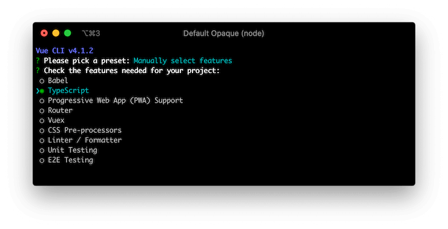

# 安装

## Vue CLI 安装

你可以通过使用 [Vue CLI](https://cli.vuejs.org/) 简单的安装 Vue Class Component. 运行下面命令来创建一个新项目:

```sh
$ vue create hello-world
```

你将被告知是否使用预设配置. 请选择 "Manually select features":


选中 TypeScript 功能来使用 Vue Class Component. 你可以添加其他你需要的功能:



输入 `y` 来回答 `Use class-style component syntax?`:


你可以按照自己的偏爱回答剩下的问题. 在结束安装进程后, Vue CLI 会创建一个新的安装了Vue Class Component 的项目目录.

## 手动安装

如果你要手动安装, 娜美你需要使用npm以及配置你自己的打包工具.

### npm

使用 `npm` 安装 Vue Class Component. 请确定你以及安装了Vue核心库, Vue Class Component依赖于它:

```sh
$ npm install --save vue vue-class-component
```

使用 `yarn` 安装:

```sh
$ yarn add --save vue vue-class-component
```

### Build Setup

使用Vue Class Component 你需要在你的项目中配置 [TypeScript](https://www.typescriptlang.org/) 或者 [Babel](https://babeljs.io/), 因为它依赖于 [ECMAScript stage 1 decorators](https://github.com/wycats/javascript-decorators/blob/master/README.md) 编译, 从而能在浏览器中运行.

::: 注意
它不支持 stage 2 decorators, 由于 TypeScript 编译器只支持旧版本装饰器.
:::

#### TypeScript

在项目根目录创建 `tsconfig.json`, 然后配置 `experimentalDecorators` 选项, 它可以编译装饰器语法:

```json
{
  "compilerOptions": {
    "target": "es5",
    "module": "es2015",
    "moduleResolution": "node",
    "strict": true,
    "experimentalDecorators": true
  }
}
```

#### Babel

安装 `@babel/plugin-proposal-decorators` 和 `@babel/plugin-proposal-class-properties`:

```sh
$ npm install --save-dev @babel/plugin-proposal-decorators @babel/plugin-proposal-class-properties
```

在文件根目录下配置 `.babelrc` 文件:

```json
{
  "plugins": [
    ["@babel/proposal-decorators", { "legacy": true }],
    ["@babel/proposal-class-properties", { "loose": true }]
  ]
}
```

注意 `legacy` 和 `loose` 选项需要 Vue Class Component 只支持 stage 1 (legacy) decorator spec.

## CDN

[unpkg.com](https://unpkg.com/) 提供基于npm的 CDN 链接. 你可以选择对应版本的 Vue Class Component 来代替 `@latest` 版本  (例如 `https://unpkg.com/vue-class-component@7.2.2/dist/vue-class-component.js` 就是使用版本为 7.2.2的Vue Class Component).

```html
<!-- UMD build -->
<script src="https://unpkg.com/vue-class-component@latest/dist/vue-class-component.js"></script>

<!-- UMD minified build -->
<script src="https://unpkg.com/vue-class-component@latest/dist/vue-class-component.min.js"></script>

<!-- ES Module build -->
<script src="https://unpkg.com/vue-class-component@latest/dist/vue-class-component.esm.browser.js"></script>

<!-- ES Module minified build -->
<script src="https://unpkg.com/vue-class-component@latest/dist/vue-class-component.esm.browser.min.js"></script>
```

## 不同的打包方式

Vue Class Component 提供不同的打包方式, 用来在不同的环境下使用

- **For development**
  - `vue-class-component.js` (UMD)
  - `vue-class-component.common.js` (CommonJS)
  - `vue-class-component.esm.js` (ES Module for bundlers)
  - `vue-class-component.esm.browser.js` (ES Module for browsers)
- **For production (minified)**
  - `vue-class-component.min.js` (UMD)
  - `vue-class-component.esm.browser.min.js` (ES Module for browsers)
